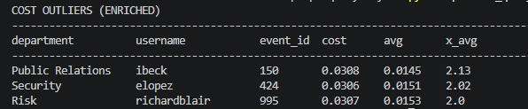

# TPA Query Layer

SQL and schema layer on top of audit data from the [TPA Governance Pipeline](https://github.com/Znovia/llm-governance-pipeline). Part of a three-layer AI governance project: pipeline → query layer → monitor (in progress).

## What this does

Reads the raw `request_logs` table produced by Layer 1, normalizes it into a star schema, and provides a library of SQL queries for operational, risk, and validation analysis.

Layer 1 produces raw governance logs. Layer 2 transforms that raw data into an analytics-friendly schema. Because the current raw dataset is small and primarily BLOCKED due to mock inputs, Layer 2 also includes a synthetic ingestion path to simulate production-like volume and variability for query development, validation, and demonstration.

Two data-loading paths are supported:

1. **Real ETL** (`scripts/load_from_pipeline.py`) — reads the pipeline's actual SQLite output and transforms it into the star schema
   - Use this to prove end-to-end integration between Layer 1 and Layer 2
2. **Synthetic generator** (`scripts/generate_data.py` + `scripts/load_to_sqlite.py`) — produces 1000 rows of synthetic data matching the same shape
   - Use this for meaningful query results (BLOCKED/CLEARED mix, real costs, time variance)

## Data flow

```
Layer 1 (pipeline)
    │
    ▼
tpa_logs.db (raw request_logs)
    │
    │  [manual copy into data/raw/]
    ▼
load_from_pipeline.py (ETL)
    │
    ▼
tpa.db (star schema: audit_events, users, departments, pii_events)
    │
    ▼
SQL queries + validation + dashboard
```

## Schema

Four tables in a small star schema:

- `audit_events` (fact) — one row per prompt event
- `users` (dim)
- `departments` (dim)
- `pii_events` (child) — one row per PII match on a blocked event

Foreign keys enforced. See `sql/schema.sql` for the full definition and `docs/field_mapping.md` for the raw-to-analytics field-by-field contract.

### Why normalize?

The raw `request_logs` table is fine for storage but awkward for analytics — department and user info repeats on every row, PII matches are stored as a comma-separated string, and cost analysis across dimensions requires self-joins. The star schema fixes those issues:

| Transformation | Raw log → Star schema |
|---|---|
| Department text → | Dimension table with `department_id` FK |
| User code text → | Dimension table with `user_id` FK |
| PII comma-string → | Child table, one row per match |
| `action` field → | `routing_decision` field (renamed for clarity) |

## Queries

11 queries across three folders:

**Operational** — daily usage, top blocked departments, cost per user (ranked), block ratio by PII type
**Risk/Quality** — PII rate by department, repeat offenders in 7 days, cost outliers (2x dept avg), MoM PII trend
**Validation** — orphan check, impossible blocks, cost sanity

Uses include window functions (`RANK`, `AVG OVER PARTITION BY`, `LAG`), CTEs, and `HAVING` clauses.

### Example: cost outliers



Uses a CTE and `AVG() OVER (PARTITION BY department_id)` to find prompts costing more than 2x their department's average. (Screenshot shown using the synthetic path — real pipeline data currently has zero-cost BLOCKED events by design.)

## Validation

All three validation queries return 0 rows against the loaded data:
- No orphan references (every event links to a valid user and department)
- No BLOCKED events with `pii_detected = 0`
- No CLEARED events with non-positive cost

## How to run

### Option 1 — Real ETL from Layer 1

```powershell
# Run Layer 1 first to produce tpa_logs.db, then copy it into this repo:
copy ..\llm-governance-pipeline\tpa_logs.db data\raw\

# Run the ETL
python scripts\load_from_pipeline.py

# Run any query
python scripts\run_query.py sql\risk_quality\cost_outliers.sql
```

### Option 2 — Synthetic data (for volume testing)

```powershell
pip install faker
python scripts\generate_data.py
python scripts\load_to_sqlite.py
python scripts\run_query.py sql\risk_quality\cost_outliers.sql
```

## Stack

Python, SQLite, Faker. Schema is Postgres-portable.

## Limitations

- Real pipeline data is low-volume and primarily BLOCKED due to hardcoded mock inputs — meaningful analytics run against the synthetic path
- SQLite for portfolio simplicity — schema ports directly to Postgres
- Dashboard not yet built
- Manual copy step between Layer 1 and Layer 2; production would use automated export

## Next steps

- Expand Layer 1's mock requests to produce higher-volume, more varied raw data
- Migrate schema to Postgres
- Add dbt models for versioned transformations and lineage
- Build Layer 3 Monitor on top of this same schema
- Replace manual db copy with an automated sync
